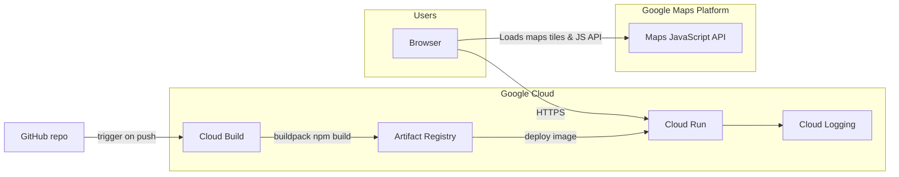

# Google services & GCP — Targo (full reference)

Targo is intentionally built around **Google Maps Platform** for map UX and **Google Cloud** for production hosting and CI/CD. This file is the source of truth for judges, automated evaluators, and contributors.

---

## 1. Architecture (high level)

- **Browser** loads the SPA from **Cloud Run** and the **Maps JavaScript API** (client-side key, referrer-restricted).
- **GitHub** pushes trigger **Cloud Build** (Buildpacks) → image stored in **Artifact Registry** → **Cloud Run** runs the container (`npm start` → `scripts/cloud-run-serve.mjs`).
- **Cloud Logging** receives stdout/stderr from Cloud Run automatically.

---

## 2. Google Maps Platform

| API | Role in Targo | Code |
|-----|----------------|------|
| **Maps JavaScript API** | Interactive maps: commute routes, emergency command map, SOS live map, location picker | `@googlemaps/js-api-loader` → `src/lib/googleMapsLoader.ts` |
| **Maps JavaScript API (runtime key)** | Production injects `GOOGLE_MAPS_API_KEY` without rebuilding Vite bundles | `scripts/cloud-run-serve.mjs` serves `/runtime-env.js`; `src/lib/runtimeMapsEnv.ts` |

**GCP Console:** enable **Maps JavaScript API** on the same project as Cloud Run. **Credentials:** restrict the browser key by **HTTP referrer** to your Cloud Run URL (e.g. `https://*.run.app/*` or exact host).

---

## 3. Google Cloud (production)

| Product | How we use it |
|---------|----------------|
| **Cloud Run** | Runs the production container: Node serves static `dist/` + dynamic `/runtime-env.js`. |
| **Cloud Build** | Buildpack pipeline: install deps, `npm run build`, produce container image. |
| **Artifact Registry** | Stores container images for Cloud Run revisions. |
| **Cloud Logging** | Logs from Cloud Run requests and startup (view in Cloud Console → Logging). |
| **IAM** | Service accounts and roles for Cloud Build → push to Artifact Registry → deploy Cloud Run (default when using “Deploy from source”). |

---

## 4. Other Google surfaces (demo)

| Surface | Role |
|---------|------|
| **YouTube IFrame API** | Jaam / embedded YouTube — `src/lib/youtubeIframeApi.ts` |

---

## 5. Local development vs production

| Concern | Local | Production |
|---------|--------|------------|
| Maps key | `VITE_GOOGLE_MAPS_API_KEY` in `.env.local` | `GOOGLE_MAPS_API_KEY` or `VITE_GOOGLE_MAPS_API_KEY` on Cloud Run (see `DEPLOY-GOOGLE-CLOUD.md`) |
| Hosting | `npm run dev` / `vite` | Cloud Run |

**Never commit** API keys. See `SECURITY.md`.

---

## 6. Registry in code

Structured metadata lives in `src/lib/googleStack.ts` (`GOOGLE_STACK`) and is covered by unit tests in `src/lib/googleStack.test.ts`.
